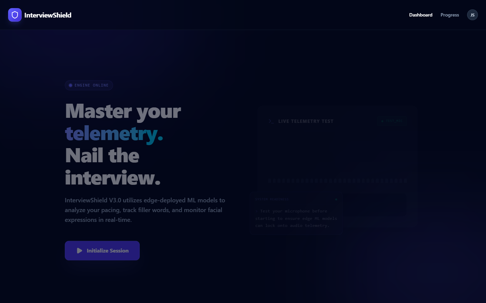
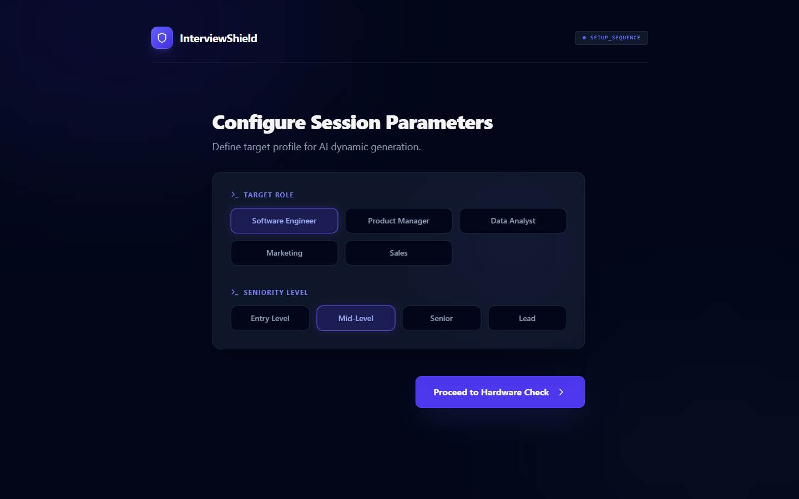
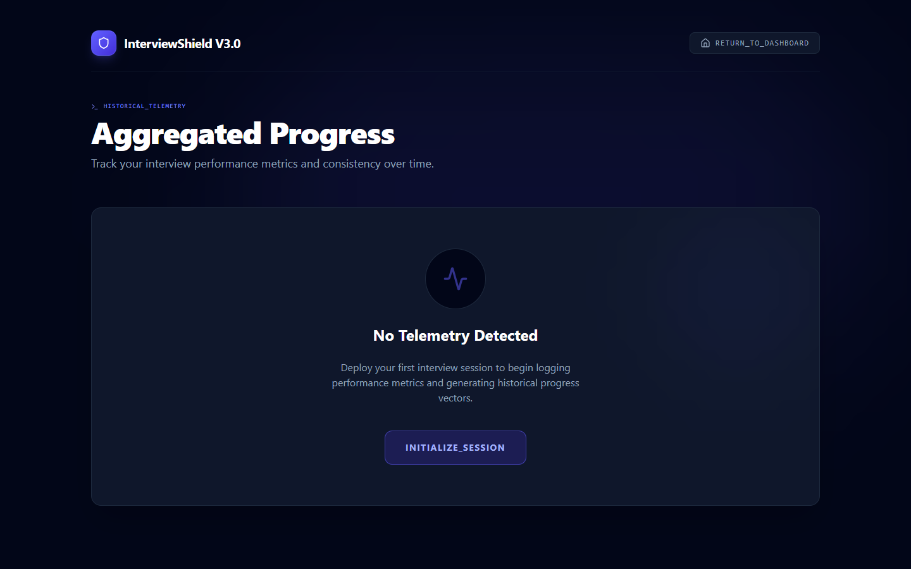
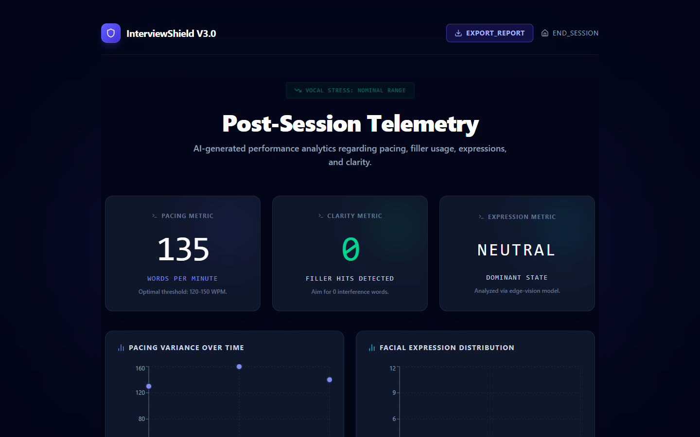
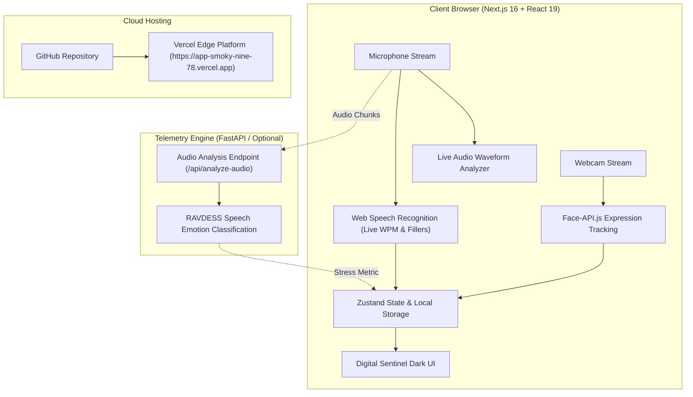

# 🛡️ InterviewShield — AI-Powered Practice Interview & Stress Coach

<div align="center">

[](https://app-smoky-nine-78.vercel.app)
[](https://nextjs.org/)
[](https://react.dev/)
[](https://www.typescriptlang.org/)
[](https://tailwindcss.com/)
[](LICENSE)

**An intelligent interview preparation coach featuring edge-deployed ML telemetry, live vocal stress analysis, real-time pacing feedback, and automated performance debriefs.**

### 🌐 [Click Here to Open the Live Web Application](https://app-smoky-nine-78.vercel.app)

[Live App](https://app-smoky-nine-78.vercel.app) • [UI Showcase](#-ui-showcase--interactive-gallery) • [Features](#-core-features) • [Architecture](#-architecture) • [Quick Start](#-quick-start)

</div>

---

## 🌟 Overview

**InterviewShield** is engineered to bridge the gap between technical readiness and psychological composure in high-stakes interviews. Leveraging browser-native audio capture, computer vision expression recognition, and real-time speech-to-text algorithms, it provides continuous biometric and verbal feedback without intrusive setups.

---

## 🌐 Live Application on Vercel

The application is deployed and running live on Vercel:

> ### 🔗 **[https://app-smoky-nine-78.vercel.app](https://app-smoky-nine-78.vercel.app)**
>
> Instant browser access with full microphone hardware testing, real-time speech recognition, and facial expression analysis.

---

## 📸 UI Showcase & Interactive Gallery

Explore the high-tech **Digital Sentinel** dark mode interface:

### 1. Command Center & Live Telemetry Test
Interactive landing page with embedded live Web Audio API frequency visualizer to test hardware before session launch.



<details>
<summary><b>🔍 View Features for this Screen</b></summary>

- Real-time AudioContext frequency analyzer rendering dynamic waveforms.
- Instant microphone connection verification.
- One-click session initialization with zero latency.
</details>

---

### 2. Session Setup & Hardware Diagnostics
Configure job role, seniority tier, and verify microphone hardware permissions prior to entering the mock interview.



<details>
<summary><b>🔍 View Features for this Screen</b></summary>

- Role selection matrix (Software Engineer, Product Manager, Data Analyst, etc.).
- Seniority mapping (Entry Level, Mid-Level, Senior, Lead).
- Automated browser microphone authorization check.
</details>

---

### 3. Historical Telemetry & Progress Trajectory
Continuous tracking of interview scores, words-per-minute (WPM), and emotional stability over time.



<details>
<summary><b>🔍 View Features for this Screen</b></summary>

- Responsive performance trajectory line chart powered by Recharts.
- Aggregate session metrics (Total sessions, Avg score, Avg pacing).
- Chronological session event log with granular expression & filler word audits.
</details>

---

### 4. Post-Session Telemetry & AI Debrief
Comprehensive performance breakdown with automated verbal pacing analysis and downloadable PDF reports.



<details>
<summary><b>🔍 View Features for this Screen</b></summary>

- WPM pacing metric against target 120–150 words/minute benchmark.
- Filler word detection counter ("um", "uh", "like", "basically").
- One-click high-resolution PDF telemetry report export.
- AI coach suggestions tailored to question transcripts.
</details>

---

## ⚡ Core Features

| Feature | Description | Engine / Stack |
| :--- | :--- | :--- |
| **Live Web App** | Hosted edge deployment with zero configuration | Vercel Edge Platform |
| **Real-time Audio Telemetry** | Edge frequency detection and audio analysis | Web Audio API / MediaStream |
| **Speech-to-Text Pacing** | Live transcription with real-time WPM calculation | Web Speech API |
| **Filler Word Counter** | Proactive warning prompts upon detecting hesitation words | Client-side Regex Engine |
| **Facial Expression Tracking** | Live emotion classification (neutral, happy, stressed) | Face-API.js (TinyFaceDetector) |
| **Acute Stress Reset** | Automatic 4-7-8 breathing intervention overlay | Framer Motion animations |
| **PDF Telemetry Export** | High-resolution printable session reports | html2canvas + jsPDF |
| **Offline-first Store** | Persistent interview history across browser reloads | Zustand with LocalStorage |

---

## 🏗️ Architecture



---

## 💻 Quick Start (Local Development)

### Prerequisites
- **Node.js**: `v18.18+` or `v20+`
- **npm** or **pnpm** / **yarn**

### 1. Clone the Repository
```bash
git clone https://github.com/sharmashweta-04/interview_shield.git
cd interview_shield
```

### 2. Install Dependencies
```bash
cd app
npm install
```

### 3. Run the Development Server
```bash
npm run dev
```

Open [http://localhost:3000](http://localhost:3000) with your browser to experience InterviewShield locally.

### 4. Build for Production
```bash
npm run build
npm run start
```

---

## 📦 Project Structure

```
interview_shield/
├── app/                         # Next.js 16 Client Application
│   ├── public/                  # Static assets & screenshots
│   │   └── screenshots/         # Hosted UI preview images
│   ├── src/
│   │   ├── app/
│   │   │   ├── debrief/         # Post-session performance report
│   │   │   ├── progress/        # Aggregated telemetry trajectory
│   │   │   ├── session/         # Real-time mock interview session
│   │   │   ├── setup/           # Profile & hardware check
│   │   │   ├── globals.css      # Dark mode theme & glass styling
│   │   │   ├── layout.tsx       # Root metadata & fonts
│   │   │   └── page.tsx         # Command Center landing page
│   │   ├── components/
│   │   │   ├── BreathingReset.tsx  # 4-7-8 Stress reset intervention
│   │   │   ├── LiveAudioDemo.tsx   # Working Web Audio frequency visualizer
│   │   │   └── StressRadar.tsx     # Dynamic composite stress meter
│   │   └── store/
│   │       └── useInterviewStore.ts # Global Zustand session store
│   └── package.json
├── backend/                     # Python FastAPI & ML models
│   ├── main.py
│   ├── train.py
│   └── requirements.txt
├── docs/
│   └── screenshots/             # Repository documentation assets
└── README.md                    # Interactive Project Documentation
```

---

## 📄 License

This project is licensed under the MIT License — see the [LICENSE](LICENSE) file for details.

---

<div align="center">
Made with 💜 for interviewees striving to master composure and communication.
</div>
